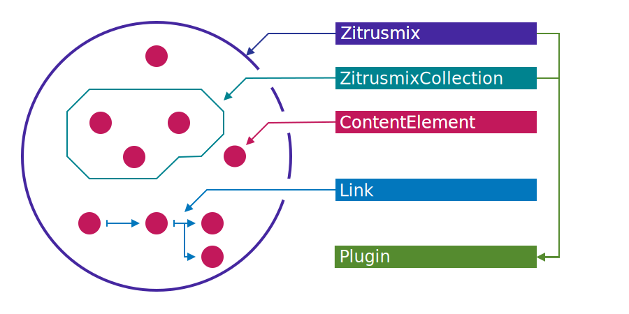

# :lemon: zitrusmix


Zitrusmix is a flexible data structure to work with connected content.

- Based on APIs you already know, like: Map, Set, Iterable
- Zero dependencies and small footprint
- Plugin support
- Shallow immutable elements
- Reactive events
- Debug friendly with polite error messages

> :boom: __EARLY ACCESS__
> Currently this library is in an alpha state. APIs and features may change.
> Please provide feedback or problem descriptions via GitHub issues, thanks a lot. 🤝

## Table of Contents

- [Getting started](#getting-started)
- [API](#api)

## Getting started

### 🚀 What can we do with this library?

### 🛠 Installation

```
npm install zitrusmix
```

### 🧪 Simple example

```typescript
import {Zitrusmix} from 'zitrusmix';

const mix = new Zitrusmix();
mix.add('/city/vie', {name: 'Vienna'});
mix.add('/city/bzo', {name: 'Bolzano'});

mix.forEach(element => console.log(element.uri, element.name));
```

## API

### Overview



Class                                                           | Description
---                                                             | ---
[Zitrusmix](/lib/Zitrusmix.ts)                      | The main entry point.
[ContentElement](/lib/ContentElement.ts)            | An element of a Zitrusmix instance.
[ZitrusmixCollection](/lib/ZitrusmixCollection.ts)  | An element subset of a Zitrusmix instance.
